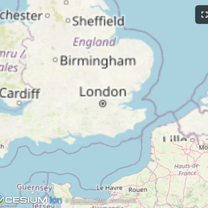
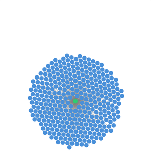
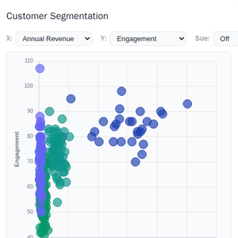
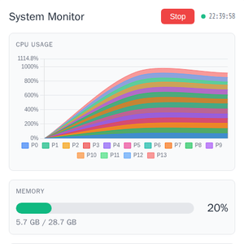
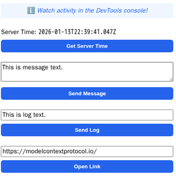

# @modelcontextprotocol/ext-apps

[](https://www.npmjs.com/package/@modelcontextprotocol/ext-apps) [](https://modelcontextprotocol.github.io/ext-apps/api/)

This repo contains the SDK and [specification](https://github.com/modelcontextprotocol/ext-apps/blob/main/specification/draft/apps.mdx) for MCP Apps Extension ([SEP-1865](https://github.com/modelcontextprotocol/modelcontextprotocol/pull/1865)).

MCP Apps are a proposed standard inspired by [MCP-UI](https://mcpui.dev/) and [OpenAI's Apps SDK](https://developers.openai.com/apps-sdk/) to allow MCP Servers to display interactive UI elements in conversational MCP clients / chatbots.

## How It Works

MCP Apps extend the Model Context Protocol to let servers deliver **interactive UIs** to MCP hosts. Here's how it works:

1. **Tool call** — The LLM calls a tool on your server
2. **UI Resource** — The tool's definition links to a predeclared `ui://` resource containing its HTML interface
3. **Host renders** — The host fetches the resource and displays it in a sandboxed iframe
4. **Bidirectional communication** — The host passes tool data to the UI via notifications, and the UI can call other tools through the host

This enables dashboards, forms, visualizations, and other rich experiences inside chat interfaces.

## Overview

This SDK serves two audiences:

### App Developers

Build interactive UIs that run inside MCP-enabled chat clients.

- **SDK for Apps**: `@modelcontextprotocol/ext-apps` — [API Docs](https://modelcontextprotocol.github.io/ext-apps/api/modules/app.html)
- **React hooks**: `@modelcontextprotocol/ext-apps/react` — [API Docs](https://modelcontextprotocol.github.io/ext-apps/api/modules/_modelcontextprotocol_ext-apps_react.html)

### Host Developers

Embed and communicate with MCP Apps in your chat application.

- **SDK for Hosts**: `@modelcontextprotocol/ext-apps/app-bridge` — [API Docs](https://modelcontextprotocol.github.io/ext-apps/api/modules/app-bridge.html)

There's no _supported_ host implementation in this repo (beyond the [examples/basic-host](https://github.com/modelcontextprotocol/ext-apps/tree/main/examples/basic-host) example).

We have [contributed a tentative implementation](https://github.com/MCP-UI-Org/mcp-ui/pull/147) of hosting / iframing / sandboxing logic to the [MCP-UI](https://github.com/idosal/mcp-ui) repository, and expect OSS clients may use it, while other clients might roll their own hosting logic.

## Installation

```bash
npm install -S @modelcontextprotocol/ext-apps
```

Or edit your `package.json` manually:

```json
{
  "dependencies": {
    "@modelcontextprotocol/ext-apps": "^0.0.1"
  }
}
```

## Examples

<!-- prettier-ignore-start -->
| | | |
|:---:|:---:|:---:|
| [](examples/map-server) | [](examples/threejs-server) | [](examples/shadertoy-server) |
| [**Map**](examples/map-server) | [**Three.js**](examples/threejs-server) | [**ShaderToy**](examples/shadertoy-server) |
| [](examples/sheet-music-server) | [](examples/wiki-explorer-server) | [](examples/cohort-heatmap-server) |
| [**Sheet Music**](examples/sheet-music-server) | [**Wiki Explorer**](examples/wiki-explorer-server) | [**Cohort Heatmap**](examples/cohort-heatmap-server) |
| [](examples/scenario-modeler-server) | [](examples/budget-allocator-server) | [](examples/customer-segmentation-server) |
| [**Scenario Modeler**](examples/scenario-modeler-server) | [**Budget Allocator**](examples/budget-allocator-server) | [**Customer Segmentation**](examples/customer-segmentation-server) |
| [](examples/system-monitor-server) | [](examples/transcript-server) | [](examples/video-resource-server) |
| [**System Monitor**](examples/system-monitor-server) | [**Transcript**](examples/transcript-server) | [**Video Resource**](examples/video-resource-server) |
| [](examples/pdf-server) | [](examples/qr-server) | |
| [**PDF Server**](examples/pdf-server) | [**QR Code (Python)**](examples/qr-server) | |

### Starter Templates

| | |
|:---:|:---|
| [](examples/basic-server-react) | The same app built with different frameworks — pick your favorite!<br><br>[React](examples/basic-server-react) · [Vue](examples/basic-server-vue) · [Svelte](examples/basic-server-svelte) · [Preact](examples/basic-server-preact) · [Solid](examples/basic-server-solid) · [Vanilla JS](examples/basic-server-vanillajs) |
<!-- prettier-ignore-end -->

The [`examples/`](https://github.com/modelcontextprotocol/ext-apps/tree/main/examples) directory contains additional demo apps showcasing real-world use cases.

To run all examples:

```bash
npm install
npm start
```

Then open http://localhost:8080/.

## Resources

- [Quickstart Guide](https://modelcontextprotocol.github.io/ext-apps/api/documents/Quickstart.html)
- [API Documentation](https://modelcontextprotocol.github.io/ext-apps/api/)
- [Draft Specification](https://github.com/modelcontextprotocol/ext-apps/blob/main/specification/draft/apps.mdx)
- [SEP-1865 Discussion](https://github.com/modelcontextprotocol/modelcontextprotocol/pull/1865)
