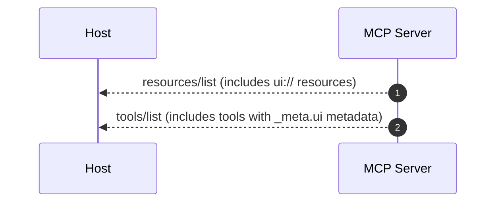
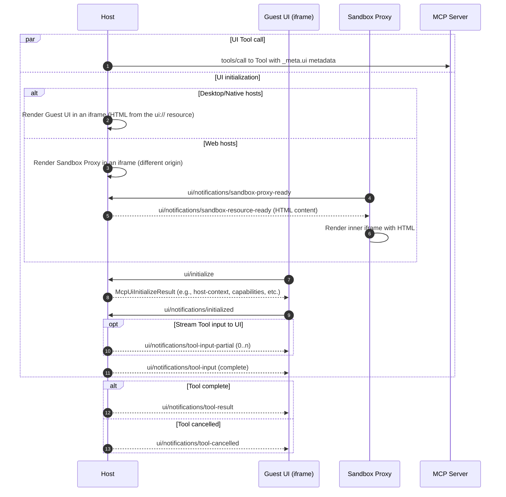
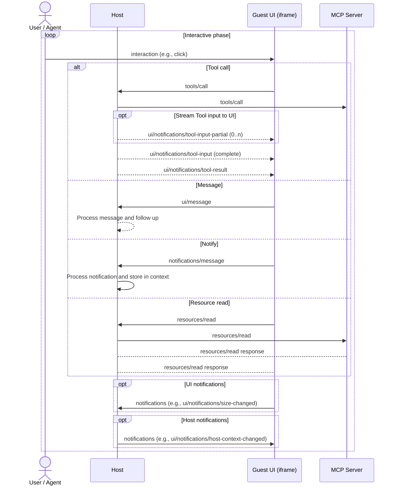
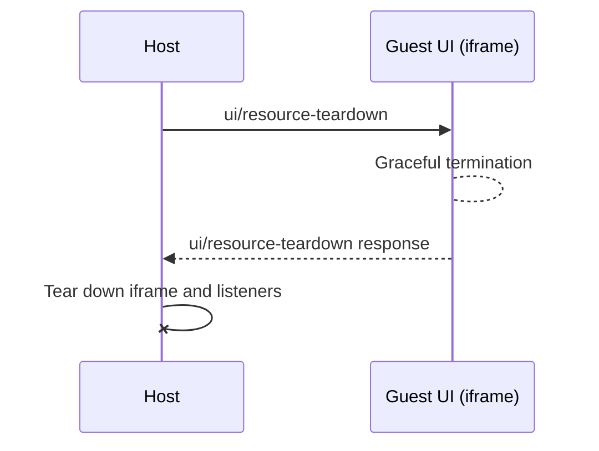

# SEP-1865: MCP Apps: Interactive User Interfaces for MCP

**Track:** Extensions

**Authors:** Ido Salomon, Liad Yosef, Olivier Chafik, Jerome Swannack, Jonathan Hefner, Anton Pidkuiko, Nick Cooper, Bryan Ashley, Alexi Christakis

**Status:** Draft

**Created:** 2025-11-21

## Abstract

This SEP proposes an extension (per SEP-1724) to MCP that enables servers to deliver interactive user interfaces to hosts. MCP Apps introduces a standardized pattern for declaring UI resources via the `ui://` URI scheme, associating them with tools through metadata, and facilitating bidirectional communication between the UI and the host using MCP's JSON-RPC base protocol. This extension addresses the growing community need for rich, interactive experiences in MCP-enabled applications, maintaining security, auditability, and alignment with MCP's core architecture. The initial specification focuses on HTML resources (`text/html;profile=mcp-app`) with a clear path for future extensions.

## Motivation

MCP lacks a standardized way for servers to deliver rich, interactive user interfaces to hosts. This gap blocks many use cases that require visual presentation and interactivity that goes beyond plain text or structured data. As more hosts adopt this capability, there's a growing risk of fragmentation and interoperability challenges.

[MCP-UI](https://mcpui.dev/) has demonstrated the viability and value of MCP apps built on UI resources and serves as a community playground for the UI spec and SDK. Fuelled by a dedicated community, it developed the bi-directional communication model and the HTML, external URL, and remote DOM content types. MCP-UI's adopters, including hosts and providers such as Postman, HuggingFace, Shopify, Goose, and ElevenLabs, have provided critical insights and contributions to the community.

OpenAI's Apps SDK, launched in November 2025, further validated the demand for rich UI experiences within conversational AI interfaces. The Apps SDK enables developers to build rich, interactive applications inside ChatGPT using MCP as its backbone.

The architecture of both the Apps SDK and MCP-UI have both significantly informed the design of this specification.

However, without formal standardization:

- Servers cannot reliably expect UI support via MCP
- Each host may implement slightly different behaviors
- Security and auditability patterns are inconsistent
- Developers must maintain separate implementations or adapters for different hosts (e.g., MCP-UI vs. Apps SDK)

This SEP addresses the current limitations through an optional, backwards-compatible extension that unifies the approaches pioneered by MCP-UI and the Apps SDK into a single, open standard.

## Specification

### Extension Identifier

This extension is identified as: `io.modelcontextprotocol/ui`

### Overview

MCP Apps extends the Model Context Protocol to enable servers to deliver interactive user interfaces to hosts. This extension introduces:

- **UI Resources:** Predeclared resources using the `ui://` URI scheme
- **Tool-UI Linkage:** Tools reference UI resources via metadata
- **Bidirectional Communication:** UI iframes communicate with hosts using standard MCP JSON-RPC protocol
- **Security Model:** Mandatory iframe sandboxing with auditable communication

This specification focuses on HTML content (`text/html;profile=mcp-app`) as the initial content type, with extensibility for future formats.

As an extension, MCP Apps is optional and must be explicitly negotiated between clients and servers through the extension capabilities mechanism (see Capability Negotiation section).

### UI Resource Format

UI resources are declared using the standard MCP resource pattern with specific conventions:

```typescript
interface UIResource {
  /**
   * Unique identifier for the UI resource
   *
   * MUST use the `ui://` URI scheme to distinguish UI resources from other
   * MCP resource types.
   *
   * @example
   * "ui://weather-dashboard"
   */
  uri: string;

  /**
   * Human-readable display name for the UI resource
   *
   * Used for listing and identifying the resource in host interfaces.
   *
   * @example
   * "Weather Dashboard"
   */
  name: string;

  /**
   * Optional description of the UI resource's purpose and functionality
   *
   * Provides context about what the UI does and when to use it.
   *
   * @example
   * "Interactive weather visualization with real-time updates"
   */
  description?: string;

  /**
   * MIME type of the UI content
   *
   * SHOULD be `text/html;profile=mcp-app` for HTML-based UIs in the initial MVP.
   * Other content types are reserved for future extensions.
   *
   * @example
   * "text/html;profile=mcp-app"
   */
  mimeType: string;

  /**
   * Resource metadata for security and rendering configuration
   *
   * Includes Content Security Policy configuration, dedicated domain settings,
   * and visual preferences.
   */
  _meta?: {
    ui?: UIResourceMeta;
  }
}

interface UIResourceMeta {
  /**
   * Content Security Policy configuration
   *
   * Servers declare which external origins their UI needs to access.
   * Hosts use this to enforce appropriate CSP headers.
   */
  csp?: {
    /**
     * Origins for network requests
     *
     * - Empty or omitted = no external connections (secure default)
     * - Maps to CSP `connect-src` directive
     *
     * @example
     * ["https://api.weather.com", "wss://realtime.service.com"]
     */
    connectDomains?: string[],
    /**
     * Origins for static resources (images, scripts, stylesheets, fonts, media)
     *
     * - Empty or omitted = no external resources (secure default)
     * - Wildcard subdomains supported: `https://*.example.com`
     * - Maps to CSP `img-src`, `script-src`, `style-src`, `font-src`, `media-src` directives
     *
     * @example
     * ["https://cdn.jsdelivr.net", "https://*.cloudflare.com"]
     */
    resourceDomains?: string[],
  },
  /**
   * Dedicated origin for widget
   *
   * Optional domain for the widget's sandbox origin. Useful when widgets need
   * dedicated origins for API key allowlists or cross-origin isolation.
   *
   * If omitted, Host uses default sandbox origin.
   *
   * @example
   * "https://weather-widget.example.com"
   */
  domain?: string,
  /**
   * Visual boundary preference
   *
   * Boolean controlling whether a visible border and background is provided by the host. Specifying an
   * explicit value for this is recommended because hosts' defaults may vary.
   *
   * - `true`: Request visible border + background
   * - `false`: Request no visible border + background
   * - omitted: host decides border
   */
  prefersBorder?: boolean,
}
```

The resource content is returned via `resources/read`:

```typescript
// resources/read response for UI resource
{
  contents: [{
    uri: string;                  // Matching UI resource URI
    mimeType: "text/html;profile=mcp-app";  // MUST be "text/html;profile=mcp-app"
    text?: string;                // HTML content as string
    blob?: string;                // OR base64-encoded HTML
    _meta?: {
      ui?: {
        csp?: {
          connectDomains?: string[];  // Origins for fetch/XHR/WebSocket
          resourceDomains?: string[]; // Origins for images, scripts, etc
        };
        domain?: string;
        prefersBorder?: boolean;
      };
    };
  }];
}
```

#### Content Requirements:

- URI MUST start with `ui://` scheme
- `mimeType` MUST be `text/html;profile=mcp-app` (other types reserved for future extensions)
- Content MUST be provided via either `text` (string) or `blob` (base64-encoded)
- Content MUST be valid HTML5 document

#### Host Behavior:

- **CSP Enforcement:** Host MUST construct CSP headers based on declared domains
- **Restrictive Default:** If `ui.csp` is omitted, Host MUST use:

  ```
  default-src 'none';
  script-src 'self' 'unsafe-inline';
  style-src 'self' 'unsafe-inline';
  img-src 'self' data:;
  media-src 'self' data:;
  connect-src 'none';
  ```

- **No Loosening:** Host MAY further restrict but MUST NOT allow undeclared domains
- **Audit Trail:** Host SHOULD log CSP configurations for security review

Example:

```json
// Resource declaration
{
  "uri": "ui://weather-server/dashboard-template",
  "name": "weather_dashboard",
  "description": "Interactive weather dashboard widget",
  "mimeType": "text/html;profile=mcp-app"
}

// Resource content with metadata
{
  "contents": [{
    "uri": "ui://weather-server/dashboard-template",
    "mimeType": "text/html;profile=mcp-app",
    "text": "<!DOCTYPE html><html>...</html>",
    "_meta": {
      "ui" : {
        "csp": {
          "connectDomains": ["https://api.openweathermap.org"],
          "resourceDomains": ["https://cdn.jsdelivr.net"]
        },
        "prefersBorder": true
      }
    }
  }]
}
```

### Resource Discovery

Tools are associated with UI resources through the `_meta.ui` field:

```typescript
interface McpUiToolMeta {
  /** URI of UI resource for rendering tool results */
  resourceUri?: string;
  /**
   * Who can access this tool. Default: ["model", "app"]
   * - "model": Tool visible to and callable by the agent
   * - "app": Tool callable by the app from this server only
   */
  visibility?: Array<"model" | "app">;
}

interface Tool {
  name: string;
  description: string;
  inputSchema: object;
  _meta?: {
    ui?: McpUiToolMeta;
    /** @deprecated Use `ui.resourceUri` instead. Will be removed before GA. */
    "ui/resourceUri"?: string;
  };
}
```

> **Deprecation notice:** The flat `_meta["ui/resourceUri"]` format is deprecated. Use `_meta.ui.resourceUri` instead. The deprecated format will be removed before GA.

Example (tool visible to both model and app):

```json
{
  "name": "get_weather",
  "description": "Get current weather for a location",
  "inputSchema": {
    "type": "object",
    "properties": {
      "location": { "type": "string" }
    }
  },
  "_meta": {
    "ui": {
      "resourceUri": "ui://weather-server/dashboard-template",
      "visibility": ["model", "app"]
    }
  }
}
```

Example (app-only tool, hidden from model):

```json
{
  "name": "refresh_dashboard",
  "description": "Refresh dashboard data",
  "inputSchema": { "type": "object" },
  "_meta": {
    "ui": {
      "resourceUri": "ui://weather-server/dashboard-template",
      "visibility": ["app"]
    }
  }
}
```

#### Behavior:

- If `ui.resourceUri` is present and host supports MCP Apps, host renders tool results using the specified UI resource
- If host does not support MCP Apps, tool behaves as standard tool (text-only fallback)
- Resource MUST exist on the server
- Host MUST use `resources/read` to fetch the referenced resource URI
- Host MAY prefetch and cache UI resource content for performance optimization
- Since UI resources are primarily discovered through tool metadata, Servers MAY omit UI-only resources from `resources/list` and `notifications/resources/list_changed`

#### Visibility:

- `visibility` defaults to `["model", "app"]` if omitted
- `"model"`: Tool is visible to and callable by the agent
- `"app"`: Tool is callable by the app from the same server connection only
- **tools/list behavior:** Host MUST NOT include tools in the agent's tool list when their visibility does not include `"model"` (e.g., `visibility: ["app"]`)
- **tools/call behavior:** Host MUST reject `tools/call` requests from apps for tools that don't include `"app"` in visibility
- Cross-server tool calls are always blocked for app-only tools

#### Benefits:

- **Performance:** Host can preload templates before tool execution
- **Security:** Host can review UI templates during connection setup
- **Caching:** Separate template (static) from data (dynamic)
- **Auditability:** All UI resources are enumerable and inspectable

### Communication Protocol

MCP Apps uses JSON-RPC 2.0 over `postMessage` for iframe-host communication. UI capabilities (e.g., tool call, prompt, etc.) will reuse MCP’s existing protocol. In the future, we may choose to enrich the communication protocol with additional MCP capabilities.

### Transport Layer

Conceptually, UI iframes act as MCP clients, connecting to the host via a `postMessage` transport:

```typescript
// UI iframe initializes MCP client
const transport = new MessageTransport(window.parent);
const client = new Client({ name: "ui-widget", version: "1.0.0" });
await client.connect(transport);
```

Note that you don’t need an SDK to “talk MCP” with the host:

```typescript
let nextId = 1;
function sendRequest(method: string, params: any) {
  const id = nextId++;
  window.parent.postMessage({ jsonrpc: "2.0", id, method, params }, '*');
  return new Promise((resolve, reject) => {
    window.addEventListener('message', function listener(event) {
      const data: JSONRPCMessage = event.data;
      if (event.data?.id === id) {
        window.removeEventListener('message', listener);
        if (event.data?.result) {
          resolve(event.data?.result);
        } else if (event.data?.error) {
          reject(new Error(event.data.error));
        }
      } else {
        reject(new Error(`Unsupported message: ${JSON.stringify(data)}`));
      }
    });
  });
}
function sendNotification(method: string, params: any) {
  window.parent.postMessage({ jsonrpc: "2.0", method, params }, '*');
}
function onNotification(method: string, handler: (params: any) => void) {
  window.addEventListener('message', function listener(event) {
    if (event.data?.method === method) {
      handler(event.data.params);
    }
  });
}


const initializeResult = await sendRequest("initialize", {
  capabilities: {},
  clientInfo: {name: "My UI", version: "1.0.0"},
  protocolVersion: "2025-06-18",
});
```

Hosts act as MCP servers (that can proxy the actual MCP server), receiving and handling requests from UI iframes.

### Sandbox proxy

If the Host is a web page, it MUST wrap the Guest UI and communicate with it through an intermediate Sandbox proxy.

1. The Host and the Sandbox MUST have different origins.
2. The Sandbox MUST have the following permissions: `allow-scripts`, `allow-same-origin`.
3. The Sandbox MUST send a `ui/notifications/sandbox-proxy-ready` notification to the host when it's ready to process an `ui/notifications/sandbox-resource-ready` notification.
4. Once the Sandbox is ready, the Host MUST send the raw HTML resource to load in a `ui/notifications/sandbox-resource-ready` notification.
5. The Sandbox MUST load the raw HTML of the Guest UI with CSP settings that:
   - Enforce the domains declared in `ui.csp` metadata
   - Prevent nested iframes (`frame-src 'none'`)
   - Block dangerous features (`object-src 'none'`, `base-uri 'self'`)
   - Apply restrictive defaults if no CSP metadata is provided
6. The Sandbox MUST forward messages sent by the Host to the Guest UI, and vice versa, for any method that doesn’t start with `ui/notifications/sandbox-`. This includes lifecycle messages, e.g., `ui/initialize` request & `ui/notifications/initialized` notification both sent by the Guest UI. The Host MUST NOT send any request or notification to the Guest UI before it receives an `initialized` notification.
7. The Sandbox SHOULD NOT create/send any requests to the Host or to the Guest UI (this would require synthesizing new request ids).
8. The Host MAY forward any message from the Guest UI (coming via the Sandbox) to the MCP Apps server, for any method that doesn’t start with `ui/`. While the Host SHOULD ensure the Guest UI’s MCP connection is spec-compliant, it MAY decide to block some messages or subject them to further user approval.

### Standard MCP Messages

UI iframes can use the following subset of standard MCP protocol messages:

**Tools:**

- `tools/call` - Execute a tool on the MCP server

**Resources:**

- `resources/read` - Read resource content

**Notifications:**

- `notifications/message` - Log messages to host

**Lifecycle:**

- `ui/initialize` → `ui/notifications/initialized` - MCP-like handshake (replaces custom iframe-ready pattern in MCP-UI)
- `ping` - Connection health check

### Host Context in `McpUiInitializeResult`

When the Guest UI sends an `ui/initialize` request to the Host, the Host SHOULD include UI-specific context in the `McpUiInitializeResult`'s `hostContext` field:

```typescript
interface HostContext {
  /** Metadata of the tool call that instantiated the App */
  toolInfo?: {
    /** JSON-RPC id of the tools/call request */
    id?: RequestId,
    /** Contains name, inputSchema, etc… */
    tool: Tool,
  };
  /** Current color theme preference */
  theme?: "light" | "dark";
  /** Style configuration for theming. See Theming section for standardized variable names. */
  styles?: {
    /** CSS variables for theming */
    variables?: Record<McpUiStyleVariableKey, string | undefined>;
    /** CSS blocks that apps can inject */
    css?: {
      /** CSS for font loading (@font-face rules or @import statements) */
      fonts?: string;
    };
  };
  /** How the UI is currently displayed */
  displayMode?: "inline" | "fullscreen" | "pip";
  /** Display modes the host supports */
  availableDisplayModes?: string[];
  /** Container dimensions for the iframe. Specify either width or maxWidth, and either height or maxHeight. */
  containerDimensions?: (
    | { height: number }      // If specified, container is fixed at this height
    | { maxHeight?: number }  // Otherwise, container height is determined by the UI height, up to this maximum height (if defined)
  ) & (
    | { width: number }       // If specified, container is fixed at this width
    | { maxWidth?: number }   // Otherwise, container width is determined by the UI width, up to this maximum width (if defined)
  );
  /** User's language/region preference (BCP 47, e.g., "en-US") */
  locale?: string;
  /** User's timezone (IANA, e.g., "America/New_York") */
  timeZone?: string;
  /** Host application identifier */
  userAgent?: string;
  /** Platform type for responsive design */
  platform?: "web" | "desktop" | "mobile";
  /** Device capabilities such as touch */
  deviceCapabilities?: {
    touch?: boolean;
    hover?: boolean;
  }
  /** Safe area boundaries in pixels */
  safeAreaInsets?: {
    top: number;
    right: number;
    bottom: number;
    left: number;
  };
}
```

Example:

```json
// Host responds with McpUiInitializeResult
{
  "jsonrpc": "2.0",
  "id": 1,
  "result": {
    "protocolVersion": "2025-06-18",
    "hostCapabilities": { /* ... */ },
    "hostInfo": { "name": "claude-desktop", "version": "1.0.0" },
    "hostContext": {
      "theme": "dark",
      "styles": {
        "variables": {
          "--color-background-primary": "light-dark(#ffffff, #171717)",
          "--color-text-primary": "light-dark(#171717, #fafafa)",
          "--font-sans": "Anthropic Sans, sans-serif",
          ...
        },
        "css": {
          "fonts": "@font-face { font-family: \"Custom Font Name\"; src: url(\"https://...\"); }"
        }
      },
      "displayMode": "inline",
      "containerDimensions": { "width": 400, "maxHeight": 600 }
    }
  }
}
```

### Container Dimensions

The `HostContext` provides sizing information via `containerDimensions`:

- **`containerDimensions`**: The dimensions of the container that holds the app. This controls the actual space the app occupies within the host. Each dimension (height and width) operates independently and can be either **fixed** or **flexible**.

#### Dimension Modes

| Mode | Dimensions Field | Meaning |
|------|-----------------|---------|
| Fixed | `height` or `width` | Host controls the size. App should fill the available space. |
| Flexible | `maxHeight` or `maxWidth` | App controls the size, up to the specified maximum. |
| Unbounded | Field omitted | App controls the size with no limit. |

These modes can be combined independently. For example, a host might specify a fixed width but flexible height, allowing the app to grow vertically based on content.

#### App Behavior

Apps should check the containerDimensions configuration and apply appropriate CSS:

```typescript
// In the app's initialization
const containerDimensions = hostContext.containerDimensions;

if (containerDimensions) {
  // Handle height
  if ("height" in containerDimensions) {
    // Fixed height: fill the container
    document.documentElement.style.height = "100vh";
  } else if ("maxHeight" in containerDimensions && containerDimensions.maxHeight) {
    // Flexible with max: let content determine size, up to max
    document.documentElement.style.maxHeight = `${containerDimensions.maxHeight}px`;
  }
  // If neither, height is unbounded

  // Handle width
  if ("width" in containerDimensions) {
    // Fixed width: fill the container
    document.documentElement.style.width = "100vw";
  } else if ("maxWidth" in containerDimensions && containerDimensions.maxWidth) {
    // Flexible with max: let content determine size, up to max
    document.documentElement.style.maxWidth = `${containerDimensions.maxWidth}px`;
  }
  // If neither, width is unbounded
}
```

#### Host Behavior

When using flexible dimensions (no fixed `height` or `width`), hosts MUST listen for `ui/notifications/size-changed` notifications from the app and update the iframe dimensions accordingly:

```typescript
// Host listens for size changes from the app
bridge.onsizechange = ({ width, height }) => {
  // Update iframe to match app's content size
  if (width != null) {
    iframe.style.width = `${width}px`;
  }
  if (height != null) {
    iframe.style.height = `${height}px`;
  }
};
```

Apps using the SDK automatically send size-changed notifications via ResizeObserver when `autoResize` is enabled (the default). The notifications are debounced and only sent when dimensions actually change.

### Theming

Hosts can optionally pass CSS custom properties via `HostContext.styles.variables` for visual cohesion with the host environment.

#### Current Standardized Variables

```typescript
/** CSS variable keys available to MCP apps for theming. */
type McpUiStyleVariableKey =
  // Background colors
  | "--color-background-primary"
  | "--color-background-secondary"
  | "--color-background-tertiary"
  | "--color-background-inverse"
  | "--color-background-ghost"
  | "--color-background-info"
  | "--color-background-danger"
  | "--color-background-success"
  | "--color-background-warning"
  | "--color-background-disabled"
  // Text colors
  | "--color-text-primary"
  | "--color-text-secondary"
  | "--color-text-tertiary"
  | "--color-text-inverse"
  | "--color-text-info"
  | "--color-text-danger"
  | "--color-text-success"
  | "--color-text-warning"
  | "--color-text-disabled"
  | "--color-text-ghost"
  // Border colors
  | "--color-border-primary"
  | "--color-border-secondary"
  | "--color-border-tertiary"
  | "--color-border-inverse"
  | "--color-border-ghost"
  | "--color-border-info"
  | "--color-border-danger"
  | "--color-border-success"
  | "--color-border-warning"
  | "--color-border-disabled"
  // Ring colors
  | "--color-ring-primary"
  | "--color-ring-secondary"
  | "--color-ring-inverse"
  | "--color-ring-info"
  | "--color-ring-danger"
  | "--color-ring-success"
  | "--color-ring-warning"
  // Typography - Family
  | "--font-sans"
  | "--font-mono"
  // Typography - Weight
  | "--font-weight-normal"
  | "--font-weight-medium"
  | "--font-weight-semibold"
  | "--font-weight-bold"
  // Typography - Text Size
  | "--font-text-xs-size"
  | "--font-text-sm-size"
  | "--font-text-md-size"
  | "--font-text-lg-size"
  // Typography - Heading Size
  | "--font-heading-xs-size"
  | "--font-heading-sm-size"
  | "--font-heading-md-size"
  | "--font-heading-lg-size"
  | "--font-heading-xl-size"
  | "--font-heading-2xl-size"
  | "--font-heading-3xl-size"
  // Typography - Text Line Height
  | "--font-text-xs-line-height"
  | "--font-text-sm-line-height"
  | "--font-text-md-line-height"
  | "--font-text-lg-line-height"
  // Typography - Heading Line Height
  | "--font-heading-xs-line-height"
  | "--font-heading-sm-line-height"
  | "--font-heading-md-line-height"
  | "--font-heading-lg-line-height"
  | "--font-heading-xl-line-height"
  | "--font-heading-2xl-line-height"
  | "--font-heading-3xl-line-height"
  // Border radius
  | "--border-radius-xs"
  | "--border-radius-sm"
  | "--border-radius-md"
  | "--border-radius-lg"
  | "--border-radius-xl"
  | "--border-radius-full"
  // Border width
  | "--border-width-regular"
  // Shadows
  | "--shadow-hairline"
  | "--shadow-sm"
  | "--shadow-md"
  | "--shadow-lg";
```

#### Host Behavior

- Hosts can provide any subset of standardized variables, or not pass `styles` at all
  - However, unexpected clashes may occur if hosts pass some color variables but not others for example, since apps are instructed to fallback on their own default values for unspecified style variables
- Hosts should use the CSS `light-dark()` function for theme-aware values (i.e. light mode and dark mode colors)

#### App Behavior

- Apps should set default fallback values for the set of these variables that they use, to account for hosts who don't pass some or all style variables. This ensures graceful degradation when hosts omit `styles` or specific variables:
```
:root {
  --color-text-primary: light-dark(#171717, #000000);
  --border-radius-small: 8px;
  ...
}
```
- Apps can use the `applyHostStyleVariables` utility (or `useHostStyleVariables` if they prefer a React hook) to easily populate the host-provided CSS variables into their style sheet
- Apps can use the `applyDocumentTheme` utility (or `useDocumentTheme` if they prefer a React hook) to easily respond to Host Context `theme` changes in a way that is compatible with the host's light/dark color variables 

Example usage of standardized CSS variables:

```css
.container {
  background: var(--color-background-primary);
  color: var(--color-text-primary);
  font-family: var(--font-sans);
}
```

#### Custom Fonts

Hosts can provide custom fonts via `styles.css.fonts`, which can contain `@font-face` rules for self-hosted fonts, `@import` statements for font services like Google Fonts, or both:

```typescript
hostContext.styles.variables["--font-sans"] = '"Font Name", sans-serif';

// Self-hosted fonts
hostContext.styles.css.fonts = `
  @font-face {
    font-family: "Font Name";
    src: url("https://url-where-font-is-hosted.com/.../Regular.otf") format("opentype");
    font-weight: 400;
    font-style: normal;
    font-display: swap;
  }
  @font-face {
    font-family: "Font Name";
    src: url("https://url-where-font-is-hosted.com/.../Medium.otf") format("opentype");
    font-weight: 500;
    font-style: medium;
    font-display: swap;
  }
`;

// Google Fonts
hostContext.styles.css.fonts = `
  @import url('https://fonts.googleapis.com/css2?family=Font+Name&display=swap');
`;
```

Apps can use the `applyHostFonts` utility to inject the font CSS into the document:

```typescript
if (hostContext.styles?.css?.fonts) {
  applyHostFonts(hostContext.styles.css.fonts);
}
```

### MCP Apps Specific Messages

MCP Apps introduces additional JSON-RPC methods for UI-specific functionality:

#### Requests (UI → Host)

`ui/open-link` - Request host to open external URL

```typescript
// Request
{
  jsonrpc: "2.0",
  id: 1,
  method: "ui/open-link",
  params: {
    url: string  // URL to open in host's browser
  }
}

// Success Response
{
  jsonrpc: "2.0",
  id: 1,
  result: {}  // Empty result on success
}

// Error Response (if denied or failed)
{
  jsonrpc: "2.0",
  id: 1,
  error: {
    code: -32000,  // Implementation-defined error
    message: "Link opening denied by user" | "Invalid URL" | "Policy violation"
  }
}
```

Host SHOULD open the URL in the user's default browser or a new tab.

`ui/message` - Send message content to the host's chat interface

```typescript
// Request
{
  jsonrpc: "2.0",
  id: 2,
  method: "ui/message",
  params: {
    role: "user",
    content: {
      type: "text",
      text: string
    }
  }
}

// Success Response
{
  jsonrpc: "2.0",
  id: 2,
  result: {}  // Empty result on success
}

// Error Response (if denied or failed)
{
  jsonrpc: "2.0",
  id: 2,
  error: {
    code: -32000,  // Implementation-defined error
    message: "Message sending denied" | "Invalid message format"
  }
}
```
Host behavior:
* Host SHOULD add the message to the conversation context, preserving the specified role.
* Host MAY request user consent.

`ui/request-display-mode` - Request host to change display mode

```typescript
// Request
{
  jsonrpc: "2.0",
  id: 3,
  method: "ui/request-display-mode",
  params: {
    mode: "inline" | "fullscreen" | "pip"  // Requested display mode
  }
}

// Success Response
{
  jsonrpc: "2.0",
  id: 3,
  result: {
    mode: "inline" | "fullscreen" | "pip"  // Actual display mode set
  }
}
```

Host behavior:
* App MUST check if the requested mode is in `availableDisplayModes` from host context.
* It is up to the host whether it switches to the requested mode, but the host MUST return the resulting mode (whether updated or not) in the response.
* If the requested mode is not available, Host SHOULD return the current display mode in the response.
* Host MAY coerce modes on certain platforms (e.g., "pip" to "fullscreen" on mobile).

Guest UI behavior:
* Guest UI SHOULD check `availableDisplayModes` in host context before requesting a mode change.
* Guest UI MUST handle the response mode differing from the requested mode.

#### Notifications (Host → UI)

`ui/notifications/tool-input` - Host MUST send this notification with the complete tool arguments after the Guest UI's initialize request completes.

```typescript
{
  jsonrpc: "2.0",
  method: "ui/notifications/tool-input",
  params: {
    arguments: Record<string, unknown>  // Tool input arguments
  }
}
```

Host sends this notification after the Guest UI's initialize request completes, when tool arguments become available. This notification is sent at most once and is required before sending `ui/notifications/tool-result`.

`ui/notifications/tool-input-partial` - Host MAY send this notification zero or more times while the agent is streaming tool arguments, before `ui/notifications/tool-input` is sent.

```typescript
{
  jsonrpc: "2.0",
  method: "ui/notifications/tool-input-partial",
  params: {
    arguments: Record<string, unknown>  // Tool input arguments
  }
}
```

The arguments object represents best-effort recovery of incomplete JSON, with unclosed structures automatically closed to produce valid JSON. Host behavior (optional):

- MAY parse the agent's partial JSON output by closing unclosed brackets/braces
- MAY send recovered arguments as they become available during streaming
- MUST stop sending once `ui/notifications/tool-input` is sent with complete arguments

Guest UI behavior (optional):

- MAY ignore these notifications entirely
- MAY render progressive loading/streaming states based on available fields
- MUST NOT rely on partial arguments for critical operations
- SHOULD gracefully handle missing or changing fields between notifications

`ui/notifications/tool-result` - Tool execution result

```typescript
{
  jsonrpc: "2.0",
  method: "ui/notifications/tool-result",
  params: CallToolResult  // Standard MCP type
}
```

Host MUST send this notification when tool execution completes (if UI is displayed during tool execution).

`ui/notifications/tool-cancelled` - Tool execution was cancelled

```typescript
{
  jsonrpc: "2.0",
  method: "ui/notifications/tool-cancelled",
  params: {
    reason: string
  }
}
```

Host MUST send this notification if the tool execution was cancelled, for any reason (which can optionally be specified), including user action, sampling error, classifier intervention, etc.

`ui/resource-teardown` - Host notifies UI before teardown

```typescript
{
  jsonrpc: "2.0",
  id: 1,
  method: "ui/resource-teardown",
  params: {
    reason: string
  }
}

// Success Response
{
  jsonrpc: "2.0",
  id: 1,
  result: {}  // Empty result on success
}

// Error Response (if failed)
{
  jsonrpc: "2.0",
  id: 1,
  error: {
    code: -32000,  // Implementation-defined error
    message: "Teardown error"
  }
}
```

Host MUST send this notification before tearing down the UI resource, for any reason, including user action, resource re-allocation, etc. The Host MAY specify the reason.
Host SHOULD wait for a response before tearing down the resource (to prevent data loss).

`ui/notifications/size-changed` - UI’s size changed

```typescript
{
  jsonrpc: "2.0",
  method: "ui/notifications/size-changed",
  params: {
    width: number,   // Viewport width in pixels
    height: number   // Viewport height in pixels
  }
}
```

Guest UI SHOULD send this notification when rendered content body size changes (e.g. using ResizeObserver API to report up to date size).

`ui/notifications/host-context-changed` - Host context has changed

```typescript
{
  jsonrpc: "2.0",
  method: "ui/notifications/host-context-changed",
  params: Partial<HostContext>  // See HostContext type above
}
```

Host MAY send this notification when any context field changes (e.g., theme toggle, display mode change, device orientation change, window/panel resize). This notification contains partial updates - Guest UI SHOULD merge received fields with its current context state.

#### Reserved Messages (Sandbox Proxy)

These messages are reserved for web-based hosts that implement the recommended double-iframe sandbox architecture:

`ui/notifications/sandbox-proxy-ready` (Sandbox Proxy → Host) - Sandbox proxy is ready

```typescript
{
  jsonrpc: "2.0",
  method: "ui/notifications/sandbox-proxy-ready",
  params: {}
}
```

`ui/notifications/sandbox-resource-ready` (Host → Sandbox Proxy) - HTML resource ready to load

```typescript
{
  jsonrpc: "2.0",
  method: "ui/notifications/sandbox-resource-ready",
  params: {
    html: string,        // HTML content to load
    sandbox: string      // Optional override for inner iframe `sandbox` attribute
  }
}
```

These messages facilitate the communication between the outer sandbox proxy iframe and the host, enabling secure loading of untrusted HTML content.

### Lifecycle

The typical lifecycle for rendering a UI resource:

#### 1. Connection & Discovery



#### 2. UI Initialization (Desktop/Native Hosts)



Note: when the Guest UI is rendered inside a sandbox, the sandbox transparently passes messages between the Guest UI and the Host, except for messages named `ui/notifications/sandbox-*`.

#### 3. Interactive Phase



#### 4. Cleanup



Note: Cleanup may be triggered at any point in the lifecycle following UI initialization.

#### Key Differences from Pre-SEP MCP-UI:

- Handshakes using MCP-like `ui/initialize` / `ui/notifications/initialized` messages instead of `iframe-ready`
- Capabilities negotiated via `McpUiInitializeResult`
- Tool data passed via notifications

### Data Passing

Tool execution results are passed to the UI through two mechanisms:

#### 1. Tool Input (via `ui/notifications/tool-input` notification)

The original tool call arguments:

```typescript
// Tool was called with (JSON-RPC request from Host to Server):
{
  jsonrpc: "2.0",
  id: 1,
  method: "tools/call",
  params: {
    name: "get_weather",
    arguments: {
      location: "San Francisco"
    }
  }
}

// UI receives (JSON-RPC notification from Host to UI):
{
  jsonrpc: "2.0",
  method: "ui/notifications/tool-input",
  params: {
    arguments: {
      location: "San Francisco"
    }
  }
}
```

#### 2. Tool Result (via `ui/notifications/tool-result` notification)

The tool's execution result:

```typescript
// Server returns from tool execution (JSON-RPC response):
{
  jsonrpc: "2.0",
  id: 1,  // Matches the tools/call request id
  result: {
    content: [
      { type: "text", text: "Current weather: Sunny, 72°F" }
    ],
    structuredContent: {
      temperature: 72,
      conditions: "sunny",
      humidity: 45
    },
    _meta: {
      timestamp: "2025-11-10T15:30:00Z",
      source: "weather-api"
    }
  }
}

// UI receives (JSON-RPC notification):
{
  jsonrpc: "2.0",
  method: "ui/notifications/tool-result",
  params: {
    content: [
      { type: "text", text: "Current weather: Sunny, 72°F" }
    ],
    structuredContent: {
      temperature: 72,
      conditions: "sunny",
      humidity: 45
    },
    _meta: {
      timestamp: "2025-11-10T15:30:00Z",
      source: "weather-api"
    }
  }
}
```

**Best Practices:**

- `content`: Text representation for model context and text-only hosts
- `structuredContent`: Structured data optimized for UI rendering (not added to model context)
- `_meta`: Additional metadata (timestamps, version info, etc.) not intended for model context

#### 3. Interactive Updates

UI can request fresh data by calling tools:

```typescript
// UI requests updated data
await client.callTool("get_weather", { location: "New York" });

// Result returned via standard tools/call response
```

This pattern enables interactive, self-updating widgets.

Note: Tools with `visibility: ["app"]` are hidden from the agent but remain callable by apps via `tools/call`. This enables UI-only interactions (refresh buttons, form submissions) without exposing implementation details to the model. See the Visibility section under Resource Discovery for details.

### Client\<\>Server Capability Negotiation

Clients and servers negotiate MCP Apps support through the standard MCP extensions capability mechanism (defined in SEP-1724).

#### Client (Host) Capabilities

Clients advertise MCP Apps support in the initialize request using the extension identifier `io.modelcontextprotocol/ui`:

```json
{
  "method": "initialize",
  "params": {
    "protocolVersion": "2024-11-05",
    "capabilities": {
      "extensions": {
        "io.modelcontextprotocol/ui": {
          "mimeTypes": ["text/html;profile=mcp-app"]
        }
      }
    },
    "clientInfo": {
      "name": "claude-desktop",
      "version": "1.0.0"
    }
  }
}
```

**Extension Settings:**

- `mimeTypes`: Array of supported content types (REQUIRED, e.g., `["text/html;profile=mcp-app"]`)

Future versions may add additional settings:

- `features`: Specific feature support (e.g., `["streaming", "persistence"]`)
- `sandboxPolicies`: Supported sandbox attribute configurations

#### Server Behavior

Servers SHOULD check client (host would-be) capabilities before registering UI-enabled tools:

```typescript
const hasUISupport =
  clientCapabilities?.extensions?.["io.modelcontextprotocol/ui"]?.mimeTypes?.includes("text/html;profile=mcp-app");

if (hasUISupport) {
  // Register tools with UI templates
  server.registerTool("get_weather", {
    description: "Get weather with interactive dashboard",
    inputSchema: { /* ... */ },
    _meta: {
      ui: { resourceUri: "ui://weather-server/dashboard" }
    }
  });
} else {
  // Register text-only version
  server.registerTool("get_weather", {
    description: "Get weather as text",
    inputSchema: { /* ... */ }
    // No UI metadata
  });
}
```

**Graceful Degradation:**

- Servers SHOULD provide text-only fallback behavior for all UI-enabled tools
- Tools MUST return meaningful content array even when UI is available
- Servers MAY register different tool variants based on host capabilities

### Extensibility

This specification defines the Minimum Viable Product (MVP) for MCP Apps. Future extensions may include:

**Content Types (deferred from MVP):**

- `externalUrl`: Embed external web applications (e.g., `text/uri-list`)

**Advanced Features (see Future Considerations):**

- Support multiple UI resources in a tool response
- State persistence and restoration
- Custom sandbox policies per resource
- Widget-to-widget communication
- Screenshot/preview generation APIs

## Rationale

This proposal synthesizes feedback from the UI CWG and MCP-UI community, host implementors, and lessons from similar solutions. The guiding principle of this proposal is to start lean and expand in the future. There are breaking changes from existing solutions, which will be addressed via the MCP-UI SDK during the migration period.

### Design Decisions

#### 1. Predeclared Resources vs. Inline Embedding

**Decision:** Require UI resources to be registered and referenced in tool metadata.

**Rationale:**

- Enables hosts to prefetch templates before tool execution, improving performance
- Separates presentation (template) from data (tool results), improving caching
- Allows hosts to review UI templates
- Aligns with MCP's resource discovery pattern

**Alternatives considered:**

- **Embedded resources:** Current MCP-UI approach, where resources are returned in tool results. Although it's more convenient for server development, it was deferred due to the gaps in performance optimization and the challenges in the UI review process.
- **Resource links:** Predeclare the resources but return links in tool results. Deferred due to the gaps in performance optimization.

#### 2. Host communication via MCP Transport

**Decision:** Use MCP's JSON-RPC base protocol over postMessage instead of custom message format.

**Rationale:**

- Reuses existing MCP infrastructure (type definitions, error handling, timeouts)
- UI developers can use standard MCP SDK (`@modelcontextprotocol/sdk`) or alternatives
- Automatic compatibility with future MCP features (long-running tools, sampling, etc.)
- Better auditability through structured JSON-RPC messages
- Reduces maintenance burden (no parallel protocol to evolve)

**Alternatives considered:**

- **Custom message protocol:** Current MCP-UI approach with message types like tool, intent, prompt, etc. These message types can be translated to a subset of the proposed JSON-RPC messages.
- **Global API object:** Rejected because it requires host-specific injection and doesn't work with external iframe sources. Syntactic sugar may still be added on the server/UI side.

#### 3. Support Raw HTML Content Type

**Decision:** MVP supports only `text/html;profile=mcp-app` (rawHtml), with other types explicitly deferred.

**Rationale:**

- HTML is universally supported and well-understood
- Simplest security model (standard iframe sandbox)
- Allows screenshot/preview generation (e.g., via html2canvas)
- Sufficient for most observed use cases
- Provides clear baseline for future extensions

**Alternatives considered:**

- **Include external URLs in MVP:** This is one of the easiest content types for servers to adopt, as it's possible to embed regular apps. However, it was deferred due to concerns around model visibility, inability to screenshot content, and review process.
- **Support multiple content types:** Deferred to maintain a lean MVP.

#### 4. Host Theming via CSS Variables

**Decision:** Provide a standardized set of CSS custom properties for visual cohesion.

**Rationale:**

- CSS variables are universal, framework-agnostic, and require no runtime
- Apps apply styles via `var(--name)` with fallbacks for graceful degradation
- Limited variable set (colors, typography, borders) ensures hosts can realistically provide all values
- Spacing intentionally excluded—layouts break when spacing varies from original design
- No UI component library—no single library works across all host environments

**Alternatives considered:**

- **Full design system:** Rejected as too prescriptive; hosts have different aesthetics
- **Inline styles in tool results:** Rejected; separating theming from data enables caching and updates
- **CSS-in-JS injection:** Rejected; framework-specific and security concerns with injected code

#### 5. Tool Visibility via Metadata

**Decision:** Use `_meta.ui.visibility` array to control tool accessibility between model and app.

**Rationale:**

- Nested `_meta.ui` structure groups all UI-related metadata cleanly
- Array format (`["model", "app"]`) allows flexible combinations
- Default `["model", "app"]` allows both agent and app to access tools
- `"app"` scope is per-server, preventing cross-server tool calls
- Cleaner than OpenAI's two-field approach (`widgetAccessible` + `visibility`)

**Alternatives considered:**

- **Two separate fields:** OpenAI uses `widgetAccessible` and `visibility` separately. Rejected as redundant; single `visibility` array covers all cases.
- **Boolean `private` flag:** Simpler but less flexible; doesn't express model-only tools.
- **Flat `ui/visibility` key:** Rejected in favor of nested structure for consistency with future `_meta.ui` fields.

### Backward Compatibility

The proposal builds on the existing core protocol. There are no incompatibilities.

### Reference Implementation

The MCP-UI project serves as a reference implementation demonstrating the core concept, though it uses pre-SEP patterns.

Olivier Chafik has developed a prototype demonstrating the pattern described in this SEP.

## Security Implications

Hosting interactive UI content from potentially untrusted MCP servers requires careful security consideration.

### Threat Model

Attackers may use the embedded UI in different scenarios. For example:

- Malicious server delivers harmful HTML content
- Compromised UI attempts to escape sandbox
- UI attempts unauthorized tool execution
- UI exfiltrates sensitive host data
- UI performs phishing or social engineering

### Mitigations

#### 1. Iframe Sandboxing

All UI content MUST be rendered in sandboxed iframes with restricted permissions.

The sandbox limits the UI from accessing the host or manipulating it. All communication with the host is done via `postMessage`, where the host is in control.

#### 2. Auditable Communication

All UI-to-host communication goes through auditable MCP JSON-RPC messages.

**Host behavior:**

- Validate all incoming messages from UI iframes
- Reject malformed message types
- Log UI-initiated RPC calls for security review

#### 3. Predeclared Resource Review

Hosts receive UI templates during connection setup, before tool execution.

**Host behavior:**

- Review HTML content for obvious malicious patterns
- Generate hash/signature for resources
- Warn users about suspicious content
- Implement allowlists/blocklists based on resource hashes

#### 4. Content Security Policy Enforcement

Hosts MUST enforce Content Security Policies based on resource metadata.

**CSP Construction from Metadata:**

```typescript
const csp = resource._meta?.ui?.csp;

const cspValue = `
  default-src 'none';
  script-src 'self' 'unsafe-inline';
  style-src 'self' 'unsafe-inline';
  connect-src 'self' ${csp?.connectDomains?.join(' ') || ''};
  img-src 'self' data: ${csp?.resourceDomains?.join(' ') || ''};
  font-src 'self' ${csp?.resourceDomains?.join(' ') || ''};
  media-src 'self' data: ${csp?.resourceDomains?.join(' ') || ''};
  frame-src 'none';
  object-src 'none';
  base-uri 'self';
`;
```

**Security Requirements:**

- Host MUST block connections to undeclared domains
- Host SHOULD warn users when UI requires external domain access
- Host MAY implement global domain allowlists/blocklists

### Other risks

- **Social engineering:** UI can still display misleading content. Hosts should clearly indicate sandboxed UI boundaries.
- **Resource consumption:** Malicious UI can consume CPU/memory. Hosts should implement resource limits.

## Reservations in MCP

- The resource prefix `ui://` will be reserved for MCP Apps
- The label `io.modelcontextprotocol/ui` is reserved
